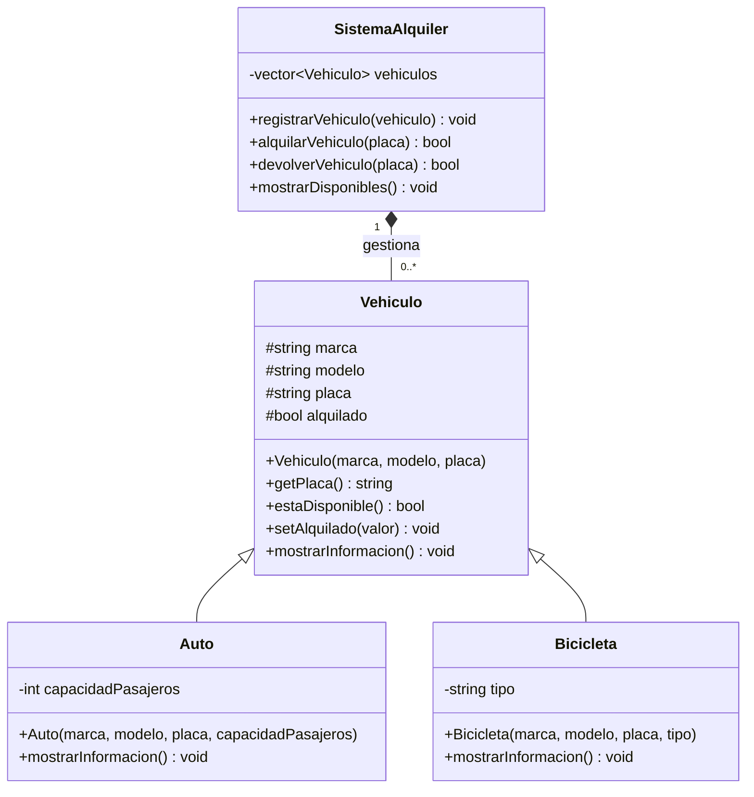

# Diagrama UML - Sistema de Alquiler de Vehiculos

```mermaid
classDiagram
    class Vehiculo {
        #string marca
        #string modelo
        #string placa
        #bool alquilado
        +Vehiculo(marca, modelo, placa)
        +getPlaca() string
        +estaDisponible() bool
        +setAlquilado(valor) void
        +mostrarInformacion() void
    }

    class Auto {
        -int capacidadPasajeros
        +Auto(marca, modelo, placa, capacidadPasajeros)
        +mostrarInformacion() void
    }

    class Bicicleta {
        -string tipo
        +Bicicleta(marca, modelo, placa, tipo)
        +mostrarInformacion() void
    }

    class SistemaAlquiler {
        -vector~Vehiculo~ vehiculos
        +registrarVehiculo(vehiculo) void
        +alquilarVehiculo(placa) bool
        +devolverVehiculo(placa) bool
        +mostrarDisponibles() void
    }

    Vehiculo <|-- Auto
    Vehiculo <|-- Bicicleta
    SistemaAlquiler "1" *-- "0..*" Vehiculo : gestiona
```
