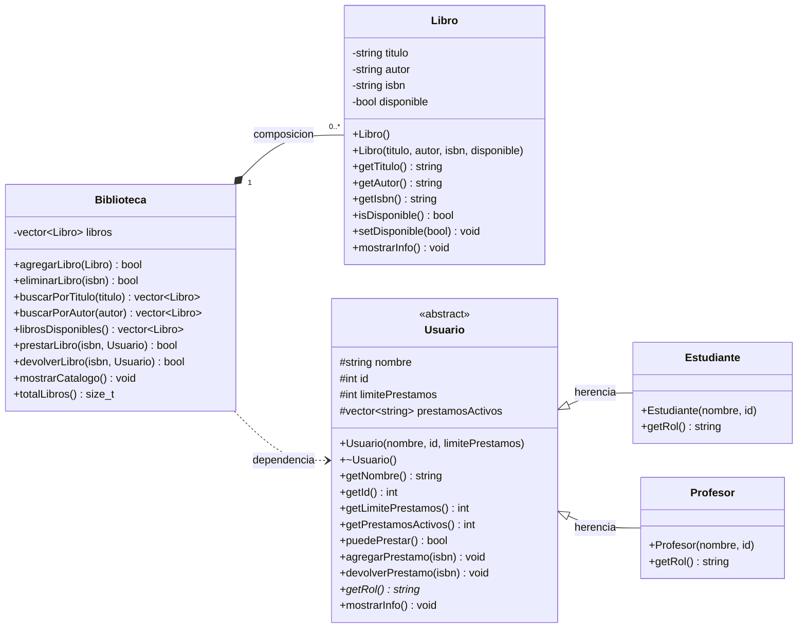

# Diagrama UML — Sistema de Gestión de Biblioteca

## Notas de diseño

### Relaciones

- **Generalización (herencia):** `Estudiante` y `Profesor` heredan de `Usuario`.
  La clase `Usuario` es abstracta (tiene `getRol()` virtual puro).

- **Composición:** `Biblioteca` ◆→ `Libro`. Los libros viven dentro de la
  biblioteca como `std::vector<Libro>` (por valor). Si la biblioteca se
  destruye, los libros también. Multiplicidad: `1` a `0..*`.

- **Dependencia:** `Biblioteca` ⇢ `Usuario`. Los métodos
  `prestarLibro(isbn, Usuario&)` y `devolverLibro(isbn, Usuario&)` reciben
  un `Usuario` por referencia, pero `Biblioteca` no lo almacena.
  Es una dependencia de uso, no de composición.

### Multiplicidades

- `Biblioteca "1" *-- "0..*" Libro` → una biblioteca contiene cero o más libros.
- Un `Libro` pertenece a exactamente una biblioteca (por diseño actual).

### Atributos y métodos

- `-` privado
- `#` protegido
- `+` público
- `*` método abstracto
